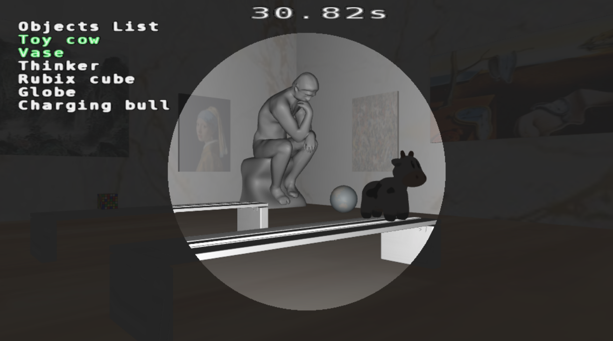

# Dark Room

This our team project for CS174A taken during Fall 2020 with Professor Law.

## Introduction 
This is an interactive game named “Night at the Museum.” The player is a security guard working night shifts at an art museum. The player is given a list of special art pieces that need extra care, that needs to be checked during the shift. Since the shift is only 60s long, the player needs to move quickly to make sure to find and check all the special art pieces. If the time is up before he checks all the art pieces, something bad might happen.  

## How to run the game
- MacOS: `./host.command`
- Windows: `host.bat`  
Then, open your browser and go to `http://localhost:8001`

## Playing the game
- Press ctrl+s to start the game 
- Use keys 'W', 'A', 'S', D' to move and 'N', 'M' to rotate the camera 
- On the left side of the spotlight, there is a list of the objects you have to find.
- Once you find the object, move towards it and bump into the object and you will see that the name of the object will turn to green 
- Find all the object before the time runs out

## Advanced features 
### Spotlight
Only source of light in this game should be the flashlight held by the player. The direction of light should be the direction of the player’s point of view, and it should not illuminate the region other than the circular region in front of the player. 

**Implementation of Spotlight**  
To do this, we extracted the eye vector from the camera transform matrix, and sent it over to the  glsl code from javascript code. 
We edited the Phong_Shader class implemented in examples/common.js, especially the glsl code, (shared code) which calculates the illumination at every point. We calculated the angle between the vector from the light source to the point and the eye vector, and set  the attenuation coefficient to be 0 if the angle was larger than some predefined limit.
Since the Textured_phong class is a  subclass of Phong_Shader class, the spotlight effect is applied to all the textured objects in our game. 

**Improving Spotlight**  
The dark area outisde the circular region was supposed to be completely dark, so that it would be more challenging for players to interact with the museum environment. However, the region outside the circular region is dimly lit with ambient lighting. This was because there was no normal vector information for .obj files that we used to import the texture of objects and the environment. When pure diffusivity was applied, without any ambience, we could not see the texture any more. To preserve the texture mapping of the objects, we needed ambience, which had illumination regardless of the position and direction of the light. This would be improved by using objects that have normal information so that diffusivity is sufficient to have correctly illuminated object, instead of relying on the ambient lighting for texture mapping. 

### Collision detection + Physics 
Collision detection mechanism serves three purposes in our game:
- To restrict the movement of the player (camera) 
- Object found detection  
We set the art pieces to be ‘found’ when the player goes near the object and actually bumps into the object.  
- To give the player a more intuitive game experience when moving around.  

**Implementation of Collision Detection**  
Whenever the user moves past a certain bound or within some kind of margin, it will be given a small “thrust” that is applied in the opposite direction (taken from the idea of real world collisions).
To do this, we construct a position array that keeps track of every object’s position in the room. We calculate the distances of our camera to every object’s position using this position array upon movement in any of the directions.

## Contributors
- Arnav Garg (@arnavgrg)
- Spencer Jin (@seoyoon-jin221)
- Olivia Loh (@olivialoh77)
- Jakin Huang (@JakinHuangWang)
